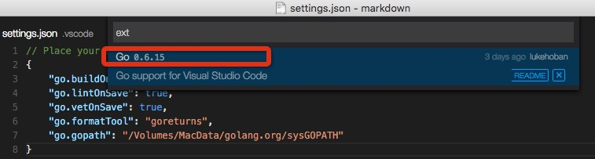
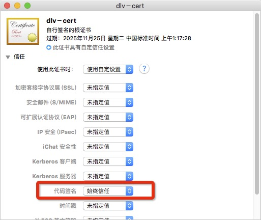
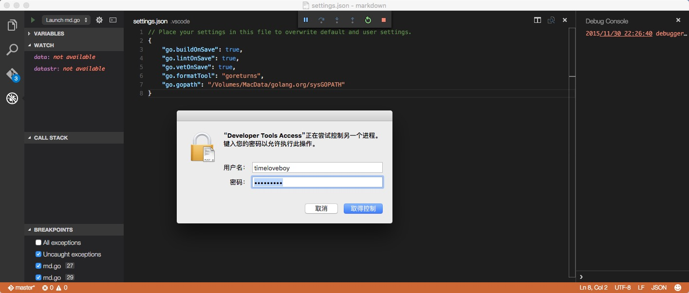
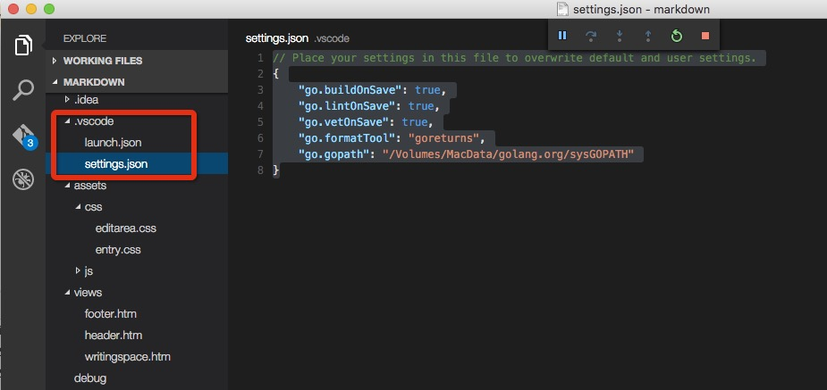

# vscode mac安装过程

##第一步
安装VSCODE

##第二步
```
cmd-shift-p
```

选择 最新版本的go-estension，一定要是最新版本，否则就会无法debug



##第三步
安装插件，这一步需要翻墙下载golang.org里的包
```
go get -u -v github.com/nsf/gocode
go get -u -v github.com/rogpeppe/godef
go get -u -v github.com/golang/lint/golint
go get -u -v github.com/lukehoban/go-find-references
go get -u -v github.com/lukehoban/go-outline
go get -u -v sourcegraph.com/sqs/goreturns
go get -u -v golang.org/x/tools/cmd/gorename
```

##第四步
安装编译delve

https://github.com/derekparker/delve

首先，通过很多次go get对这个包进行gobuild，的到一个二进制文件


接下来，配置钥匙串证实管理

打开"钥匙串访问"应用程序 (/ 应用程序/实用程序/钥匙扣 Access.app)
在打开的菜单钥匙串访问/证书助理/创建证书......

选择名称 (dlv-cert在示例中)，将"身份类型"设置为"自签名根"，将"证书类型"设置为"代码签名"并选择"让我重写默认值"。单击"继续"。你可能想要预定义 365 天期延长至 3650 天。

在"继续"上单击几次，直到你走到"指定位置为证书"屏幕，然后设置"钥匙串到系统"。

如果您不能将证书存储在"系统"的钥匙串，创建在"登录"钥匙扣，然后将它导出。您然后可以将其导入的"系统"钥匙串。

在钥匙串中，选择"系统"，和您应该发现您的新证书。为证书使用上下文菜单、 选择"Get Info"、 打开"信任"项目，并设置"代码签名"到"总是信任"。

在钥匙串-dlv-证书-> 选择类别键右键单击-GetInfo-访问控制->-> 保存更改选择"允许访问此项目的所有应用程序"。

您必须先退出"钥匙串访问"应用程序以使用证书，并且通过杀死当前正在运行的"taskgated"进程重新启动"taskgated"服务。或者你可以重新启动您的计算机。




如果钥匙串显示
```
timeloveboydeiMac:delve timeloveboy$ CERT=dlv-cert make install
go install -ldflags="-s" github.com/derekparker/delve/cmd/dlv
codesign -s dlv-cert /Volumes/MacData/golang.org/sysGOPATH//bin/dlv
dlv-cert: no identity found
make: *** [install] Error 1
```
那么最好重新创建一个系统证书
在delve目录下（有mackfile的目录），执行

```
timeloveboydeiMac:delve timeloveboy$ CERT=timeloveboy  make install
go install -ldflags="-s" github.com/derekparker/delve/cmd/dlv
codesign -s timeloveboy /Volumes/MacData/golang.org/sysGOPATH//bin/dlv
```

这样就表示成功了
##第5步

重新打开vscode，f5,debug




vscode会在目录下创建一个文件夹

可以看到launch.json
